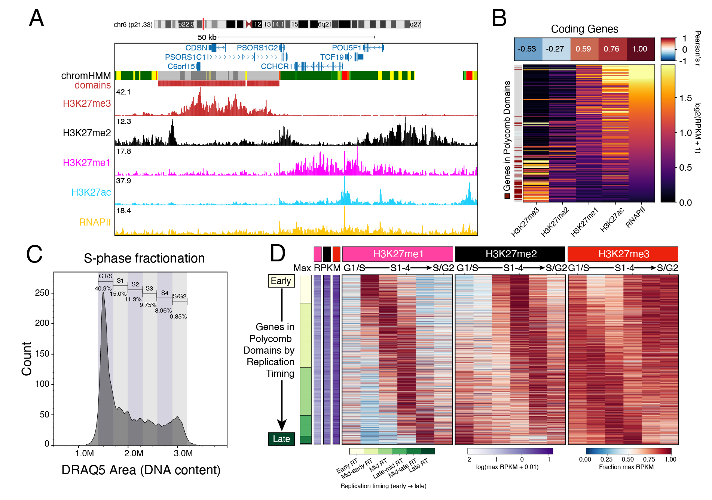

# H3K27me2



Analysis code for the manuscript *"Histone H3K27 methylation states are sequentially
catalyzed in cycling cells"* by Greene, Ahmad, and Henikoff, 2026.

## Data availability

| Source | Accession | Contents |
|---|---|---|
| GEO | [`GSE327802`](https://www.ncbi.nlm.nih.gov/geo/query/acc.cgi?acc=GSE327802) | Raw CUT&Tag sequencing data |
| Zenodo | [`10.5281/zenodo.19489947`](https://doi.org/10.5281/zenodo.19489947) | Processed data (the rest of the `data/` folder) |
| UCSC | [browser session](https://genome.ucsc.edu/s/jegreene/H3K27me2_manuscript) | Interactive tracks |

---

## Quick start

```bash
git clone https://github.com/jacob-greene/H3K27me2.git
cd H3K27me2

bash install.sh                        # the three conda environments, plus gtftools
conda activate h3k27me2-notebooks
jupyter lab notebooks/
```

Two notebooks run on a clone as it stands: `K27me3_states_111epigenomes_pub.ipynb` (fetches
its own data over HTTPS) and `250214_growth_viability_cellcycle_pub.ipynb` (reads only files
that ship here). The other six need the Zenodo archive, unpacked so its contents land inside
the `data/` directory that ships with this repo — see "Expected `data/` layout" below.

Every path is relative to the **repository root**. The notebooks resolve the root themselves
in their first cell; run the processing scripts from the root.

### Layout

```
H3K27me2/
├── install.sh               conda environments + gtftools
├── notebooks/               the 8 publication notebooks (the figures)
├── processing_scripts/      25 scripts that build the processed data; run.sh drives them
├── envs/                    conda environment files
├── data/                    input data — a few files ship here, the rest from Zenodo
├── figures/                 written by the notebooks; PDFs and figure-source TSVs, flat
└── THIRD_PARTY_NOTICES.md   licence terms for the two redistributed supplement files
```

### Environments

| File | Covers |
|---|---|
| `envs/notebooks.yml` | the 8 publication notebooks |
| `envs/processing.yml` | `processing_scripts/`, except the two R scripts |
| `envs/r.yml` | `251113_DGE_RUVseq.R`, `251202_DGE_RUVseq_drug.R` |

Only `bowtie2` and `cutadapt` are pinned, to the versions the manuscript Methods name.
`gtftools`, needed by the `annotation` stage, is not on conda-forge or bioconda;
`install.sh` downloads it from <https://www.genemine.org/gtftools.php> and installs it into
the `h3k27me2-processing` environment.

On an Lmod cluster the scripts load a module only when the tool is not already on `PATH`,
so an activated environment takes precedence and its versions — not the modules' — are
what actually run.

---

## Notebooks

`notebooks/K27me3_states_111epigenomes_pub.ipynb` also needs `bedtools` on `PATH` (it is in
`envs/notebooks.yml`; or set `BEDTOOLS_BIN` to prepend a specific directory).

Two notebooks are producers as well as consumers, so start with these two, in this order:

1. **`K27me3_states_111epigenomes_pub.ipynb`** — writes
   `data/2024/ENCODE_states/K562_E123_15_coreMarks_domains.bed`.
2. **`250411_peakPrint_clean_pub.ipynb`** — writes
   `data/2024/SH_all_data/downsample_peakPRINT_slope1_min300/min350/top95/*_top95regions.bed`.

Then, in any order: `250214_growth_viability_cellcycle_pub.ipynb`,
`250911_RIFs_FC_pub.ipynb`, `251203_drug_timeseries_pub.ipynb`,
`260801_nucleation_pub.ipynb`, `260803_WT_timeseries_clean_chromHMM_pub.ipynb`,
`bulk_RT_pub.ipynb`.

Figures and figure-source tables are written flat into `figures/` — no sub-directories, and
no two cells write the same filename.

---

## Processing scripts

`processing_scripts/run.sh` drives them. Run it from the repository root:

```bash
conda activate h3k27me2-processing

bash processing_scripts/run.sh list        # the stages, in dependency order
bash processing_scripts/run.sh selftest    # ~1 min, needs no external data
bash processing_scripts/run.sh fetch       # download the public third-party inputs
bash processing_scripts/run.sh <stage>     # DRY_RUN=1 prints without running
```

The stages run in the order `list` prints them: download first, then process. `selftest`
calls peaks on synthetic fragments, to check that a clone is wired up before you spend
hours on real data. `fetch` wraps `processing_scripts/fetch_external_data.sh`, which pulls
the public third-party inputs — GENCODE GTFs, an MSigDB gene set, Repli-seq, ENCODE and GEO
tracks — into their expected places under `data/`; `fetch_external_data.sh list` names each
one, and the whole set is ~2.5 GB. Every other stage needs the Zenodo archive unpacked into
`data/` first.

Three stages carry caveats, which `run.sh` repeats when you invoke them: `align` was
transcribed from the Methods and **has never been executed by the authors**; `blacklist`
reads four lab-internal files and its output already ships; `dge` uses `envs/r.yml` instead
of the processing environment. `nucleation` submits a Slurm array and returns — run
`python3 processing_scripts/build_per_bin_covcorr.py` once those jobs finish.

**Upstream of everything — read trimming and alignment.** `filter_sams*.sh` consume
duplicate-marked bowtie2 SAMs, which the authors produced with a lab-internal pipeline that
is not in this repository. `geo_to_sams.sh` can process the GEO `GSE327802` fastqs into SAM
files.

---

## What ships in `data/`

Everything else in `data/` comes from the Zenodo archive or from `run.sh fetch`.

| File | Size | Provenance |
|---|---|---|
| `250214_K27me123ac_P2S25p_TAZEEDUTX_cell_counts.xlsx` | 17 KB | this study |
| `20260206_drug_8only_aurora/*.csv` (15 files) | 6.3 MB | this study — Aurora flow-cytometry exports |
| `Kc_merged_blacklist_hg38.bed` | 7.9 MB | this study — *Drosophila* spike-in blacklist, 286,386 intervals |
| `2024/LAD_data/JG_coding_genes_maxRPKM.tsv` | 630 KB | this study — per-gene max RPKM + replication timing |
| `chr_lens.txt` | 12 KB | UCSC hg38 chromosome sizes |
| `2024/LAD_data/Dataset_S1_Promoter_SuRE_Classification.tsv` | 3.2 MB | **published supplement, not this study** |
| `2024/LAD_data/Dataset_S2_TRIP.tsv` | 1.1 MB | **published supplement, not this study** |

`Dataset_S1` / `Dataset_S2` are from Leemans et al., *Cell* 177:852–864 (2019), redistributed
unmodified under **CC BY-NC-ND 4.0** so that `260803_WT_timeseries_clean_chromHMM_pub.ipynb`
runs without a manual download. **Cite that paper, not this one, for those two files**, and
see [`THIRD_PARTY_NOTICES.md`](THIRD_PARTY_NOTICES.md) for the terms.

## Expected `data/` layout

```
data/
├── 2024/
│   ├── cCREs/intersected_annos/
│   │   ├── FRIPs.tsv
│   │   └── FC_out/*_featureCounts_bulk_counts.tsv, *.summary.tsv
│   ├── ENCODE_chromHMM/{FRIPs.tsv, OverlapEnrichments.tsv}
│   ├── ENCODE_states/K562_E123_15_coreMarks_domains.bed
│   ├── K562_annotations/
│   │   ├── gencode.v44.basic.annotation.coding.gtf          (run.sh fetch)
│   │   └── processed_beds/sorted/gencode.v44.basic.TSS-1000_TES_sorted.{bed,saf}
│   ├── LAD_data/
│   │   ├── gencode.v27.annotation.gtf.gz                    (run.sh fetch)
│   │   └── *.saf
│   ├── MTF2_GSE164804/*.bw       ENCFF587SWK / ENCFF065KGU (run.sh fetch);
│   │                             MTF2_shCT_hg38_coverage.bw from Zenodo
│   ├── RepliSeq/*.bigWig         UW Repli-seq K562 **hg19** (run.sh fetch) —
│   │                             the INPUT to crossmaphg19tohg38.sh
│   ├── RepliTag/
│   │   ├── bws_bulk/*.bw
│   │   ├── filtered_sams_WT_1.0/, filtered_sams_drug_1.0/
│   │   ├── Matrices/{coverage_scores_*.tab, TAZEED/}
│   │   ├── refs/GOBP_CELL_CYCLE.v2025.1.Hs.json             (run.sh fetch)
│   │   └── RepliSeq/hg38_bws_crossmap/     (written by crossmaphg19tohg38.sh)
│   └── SH_all_data/
│       ├── sections4/, merged_bams4/, merged_bws4/
│       ├── peakPRINT_50/MERGED_downsampled_bins.tsv
│       └── downsample_peakPRINT_slope1_min300/
│           ├── reproducibility/FRiPs_merged_intervals_rep95.tsv
│           └── min350/{*.bed, *_meta_v*.tsv, top95/*}
└── results/
    ├── mtf2_nucleation/{nuc_cpgonly_spread_bins.tsv.gz, per_bin_covcorr_full.tsv.gz}
    └── replitag_sphase_nucleation/matrices/
            encode_coremarks.1000bp.{rpkm,read_count}.matrix.tsv.gz
```

## License

The code and documentation in this repository are MIT licensed; see [`LICENSE`](LICENSE).
That grant covers this repository's own work only. It does not cover the two redistributed
supplement files under `data/2024/LAD_data/`, which keep the terms recorded in
[`THIRD_PARTY_NOTICES.md`](THIRD_PARTY_NOTICES.md).
