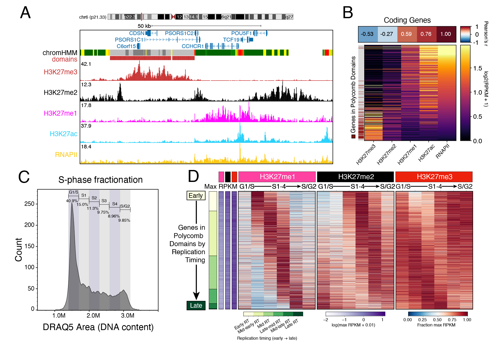

# H3K27 methylation states are sequentially catalyzed in cycling cells

[](https://doi.org/10.5281/zenodo.22696735)
[](LICENSE)

Analysis code for *"Histone H3K27 methylation states are sequentially catalyzed in cycling
cells"* by Jacob E. Greene, Kami Ahmad and Steven Henikoff (2026),
[bioRxiv 10.64898/2026.04.30.721988](https://doi.org/10.64898/2026.04.30.721988).

**The finding.** Polycomb domains silence developmental genes and are marked by
tri-methylation of histone H3 lysine 27 (H3K27me3). Every S phase halves that mark, because
new, unmodified histones are deposited behind the replication fork. We used CUT&Tag on
human K562 cells sorted into S-phase fractions to follow H3K27me1, -me2 and -me3 through
replication. H3K27me3 in Polycomb domains is restored *stepwise* (me1, then me2, then me3)
after DNA replication. Outside Polycomb domains, thousands of inactive genes gain H3K27me2
hours after replication. Acute inhibition of PRC2, the H3K27 methyltransferase, slows this
re-methylation during S phase and raises H3K27 acetylation, most strongly at
early-replicating Polycomb domains.



<sub>**Figure 1.** (A) H3K27me3, me2, me1, H3K27ac and RNA polymerase II CUT&Tag around a
Polycomb domain in K562 cells. (B) Correlation of each mark across coding genes.
(C) Sorting cells into S-phase fractions by DNA content. (D) Each methylation state across
the S-phase fractions, for Polycomb-domain genes ordered by replication timing.</sub>

## Repository layout

| Path | What it holds |
|---|---|
| [`notebooks/`](notebooks) | The eight Jupyter notebooks that make the figures and statistics |
| [`processing_scripts/`](processing_scripts) | Shell, Python and R scripts that turn sequencing reads into the processed tables the notebooks read; [`run.sh`](processing_scripts/run.sh) drives them stage by stage ([details](processing_scripts/README.md)) |
| [`data/`](data) | Small inputs that ship with the repository; everything else is downloaded into it ([details](data/README.md)) |
| `figures/` | Output: every PDF and figure-source table the notebooks write |
| [`environment.yml`](environment.yml) | The single conda environment for all of the above |

## Quick start

Needs [conda](https://conda-forge.org/download/) (or mamba / micromamba) and about 4 GB of
disk for the environment.

```bash
git clone https://github.com/jacob-greene/H3K27me2.git
cd H3K27me2
conda env create -f environment.yml
conda activate h3k27me2

# Reproduce the growth, viability and cell-cycle panels (about 1 minute).
jupyter nbconvert --to notebook --execute --inplace \
    notebooks/250214_growth_viability_cellcycle_pub.ipynb
ls figures/        # growth_curves.pdf, viability_curves.pdf, cellcycle_*.pdf, ...
```

To explore interactively instead, run `jupyter lab notebooks/`. Every notebook finds the
repository root by itself, so it can be opened from anywhere inside the clone.

## Reproducing each notebook

| Notebook | What it shows | Data it needs |
|---|---|---|
| `250214_growth_viability_cellcycle_pub` | Growth, viability and cell-cycle profiles under PRC2 inhibitors | ships with the repository |
| `K27me3_states_111epigenomes_pub` | H3K27me3 domains across Roadmap epigenomes; writes the K562 Polycomb-domain BED other notebooks use | downloads Roadmap ChromHMM segmentations itself |
| `260803_WT_timeseries_clean_chromHMM_pub` | Re-methylation of each H3K27 state through S phase, by chromatin state and replication timing | `fetch`, then processed-read tables |
| `251203_drug_timeseries_pub` | The same time series under PRC2 inhibitors | `fetch`, then processed-read tables |
| `250411_peakPrint_clean_pub` | Peak calling and the top-95% regions for each mark | processed-read tables |
| `250911_RIFs_FC_pub` | Reads in genomic features; correlation of marks across coding genes | processed-read tables |
| `260801_nucleation_pub` | Polycomb nucleation sites versus spreading regions | processed-read tables |
| `bulk_RT_pub` | Replication-timing distribution of each mark | processed-read tables |

**`fetch`** is one command that downloads this study's processed data from Zenodo and the
public reference files (GENCODE, MSigDB, ENCODE, Repli-seq) into `data/`, with checksums:

```bash
bash processing_scripts/run.sh fetch          # about 2.8 GB
```

**Processed-read tables** are built from the raw GEO reads by `processing_scripts/`. Those
stages need a compute cluster and are documented in
[`processing_scripts/README.md`](processing_scripts/README.md).

## Data availability

| Source | Accession | Contents |
|---|---|---|
| GEO | [GSE327802](https://www.ncbi.nlm.nih.gov/geo/query/acc.cgi?acc=GSE327802) | Raw CUT&Tag reads |
| Zenodo | [10.5281/zenodo.19489947](https://doi.org/10.5281/zenodo.19489947) | Processed data: differential time series and peak regions |
| UCSC | [browser session](https://genome.ucsc.edu/s/jegreene/H3K27me2_manuscript) | Interactive tracks |

## Citation

If you use this code, please cite the manuscript. GitHub's "Cite this repository" button
(from [`CITATION.cff`](CITATION.cff)) gives the reference in BibTeX or APA form. The code
itself is archived on Zenodo at
[10.5281/zenodo.22696735](https://doi.org/10.5281/zenodo.22696735).

## AI Use Statement

The analysis code (i.e. jupyter notebooks) in this repository was written by Jacob Greene. Claude-code was used to modify paths to align with processing scripts (i.e. fetching public data) that were written for end-to-end reproducibility AFTER manuscript submission. Please flag any issues on this repo and/or refer them jacobgreene@gmail.com.

## License

The code and documentation are MIT licensed; see [`LICENSE`](LICENSE). Two redistributed
supplement files under `data/2024/LAD_data/` keep their own terms; see
[`THIRD_PARTY_NOTICES.md`](THIRD_PARTY_NOTICES.md).
